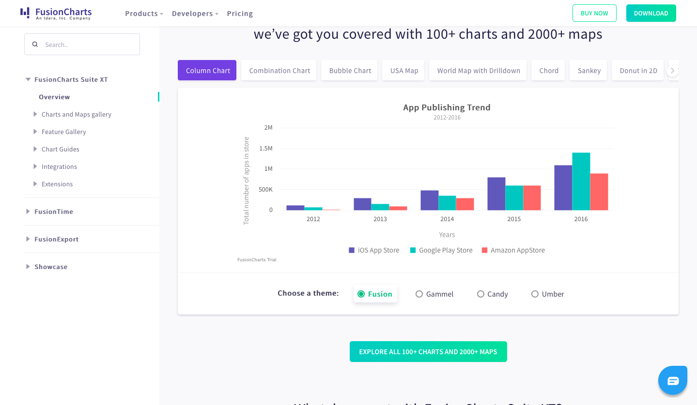

# Coding Assignment Submission Readme

This is where the top most short description of your project will go


## Problem Statement

This is where you will describe all problem statement of your project. Ideally you should be able to copy the text from the problem statement writeup here.

## User Guide

You can include the steps to run the project locally like this.  For example for a javascript project you can do.

Installing dependencies

```sh
npm install 
```

Running the project

```sh
npm run start 
```


## Project Description

This is where you describe your project. How you solved it. You approach to the problem or any unique insight about the problem that you wish to share. This is your writeup. 

You can also add a folder structure to your readme to explain where all the modules are located.  This is an example for create-react-app. You can create a one like this for yours.

```
my-app
├── README.md
├── node_modules
├── package.json
├── .gitignore
├── public
│   ├── favicon.ico
│   ├── index.html
│   └── manifest.json
└── src
    ├── App.css
    ├── App.js
    ├── App.test.js
    ├── index.css
    ├── index.js
    ├── logo.svg
    └── serviceWorker.js
    └── setupTests.js
```


If you feel like adding screenshots to the readme will be the best way to communicate your ideas. You can also use the markdown template below to add images to your Readme.

<p align="center">

</p>

You can use the same mix of HTML & markdown to add any external assets as you may need to describe your project.


## Built with

* This is where you list down any major technologies or libraries used in the project along with the link to the source like the ones below.
* This project was bootstrapped with [Create React App](https://github.com/facebook/create-react-app).
* [Styled-components](https://styled-components.com/) to create resuable and more organised components.

